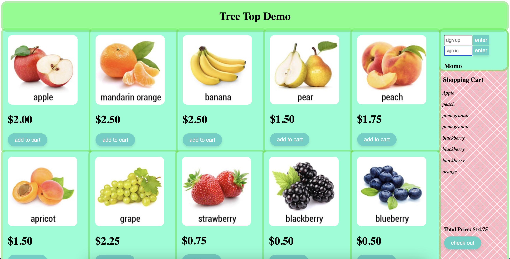

# Fruit Store Web App

# Overview

This program allows users to create an account, sign in, and add to their shopping cart.

I wrote this software to demonstrate my understanding of Vue.js and Java.

[Software Demo Video](https://us06web.zoom.us/rec/share/S_MsCOf6z8J7vOuAadCY4xuP_5u6vFGl0WuP4DyUpvsC0OwQY-jtOAtH3AJvz0IY.m8Ajus7jVvyCyJUj?startTime=1709774724000)

# Vue.js Components

The front end is made up of 5 components.

The \<fruit> component recieves props and uses them to display the proper picture and info for each item. It handles button clicks by emiting data to the parent component to be used in the shopping cart.

the \<catalog> component houses the fruit components, passes props to them, and gives them structure.

the \<shoppingCart> component makes most of the API requests. It displays the items selected by the user. It also allows the user to sign up, sign in, and check out.

the \<structure> component arranges the child components and passes them to the app.

\<app> sends it all to the html page.

# Development Environment

The backend API and server and written with Java, MySQL, and Spring.

The front end uses Vue.js, HTML, and CSS

# Useful Resources

- [Code With Arjun Youtube](https://www.youtube.com/watch?v=4LZKnegAm4g&t=2110s)
- [Traversy Media Youtube](https://www.youtube.com/watch?v=qZXt1Aom3Cs)

# Future Work

- Implement data encryption and password hashing
